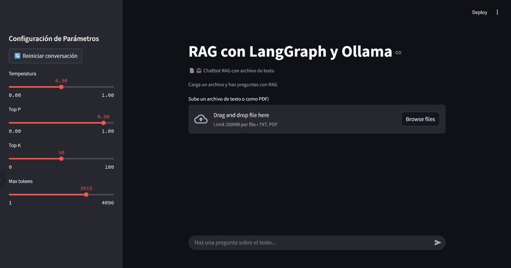
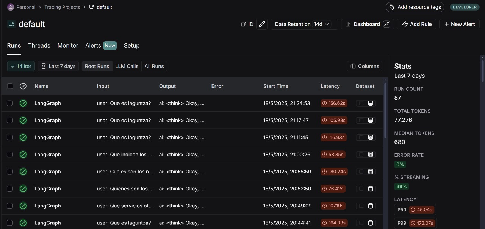
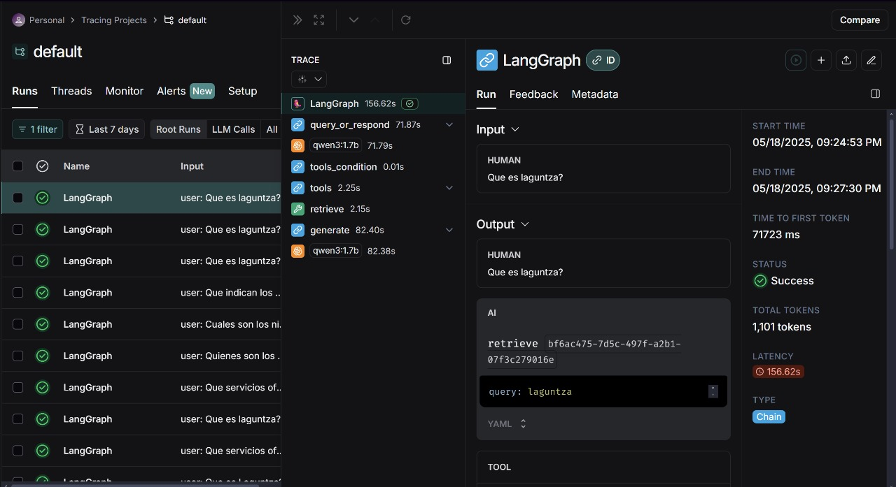
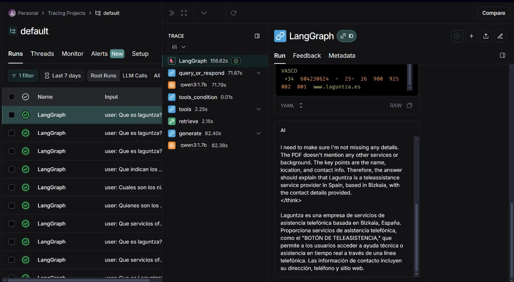

# Chatbot RAG con LangGraph, Langchain y Ollama

Este proyecto implementa un **chatbot interactivo** capaz de responder preguntas sobre documentos en formato PDF o texto plano (`.txt`), utilizando la técnica **RAG (Retrieval-Augmented Generation)**. Está desarrollado como parte de la **especialización en Inteligencia Artificial** y emplea herramientas modernas como **LangChain, Chroma, LangGraph y Ollama**, con trazabilidad potencial mediante **LangSmith**.

## Objetivo principal

Desarrollar un chatbot conversacional que interactue con el usuario y le permita:

- Cargar un archivo como pdf o como txt.
- Realizar preguntas sobre el contenido del archivo.
- Obtener respuestas acordes a la pregunta realizada, basandose en los chunk generados del RAG.

## Herramientas utilizadas

- **LangChain**: framework principal para construcción de aplicaciones LLM.
- **LangGraph**: para modelar y ejecutar el flujo conversacional de múltiples pasos.
- **Chroma**: base de datos vectorial para realizar búsquedas semánticas.
- **Ollama**: para ejecutar modelos LLM y de embeddings localmente.
- **Streamlit**: interfaz gráfica del chatbot.
- **Embeddings**: modelo `nomic-embed-text:latest`.
- **LLM**: modelo `qwen3:1.7b`.

## Arquitectura del RAG

1. **Carga del documento** (`.pdf` o `.txt`).
2. **División en fragmentos** mediante `RecursiveCharacterTextSplitter`.
3. **Vectorización** con `OllamaEmbeddings` y almacenamiento en Chroma.
4. **Consulta del usuario** ➡️ se consulta el vector store.
5. **Contextualización de la respuesta** con documentos relevantes.
6. **Generación de la respuesta final** mediante un LLM local (`qwen3`).

## Verficacion de trazabilidad con LangSmith

## Ejemplos de Preguntas

El chatbot puede responder preguntas basadas en el contenido del documento PDF que cargues. Aquí tienes algunos ejemplos de preguntas útiles en este caso del PDF de laguntza:

❓ ¿Qué es Laguntza?

❓ ¿Qué servicios ofrecen?

❓ ¿Dónde están ubicados?

❓ ¿Con cuántos trabajadores cuentan en la empresa?

❓ ¿Cuál es su objetivo principal?

💡 Estas preguntas se responden de forma contextualizada únicamente si la información está presente en el documento cargado.